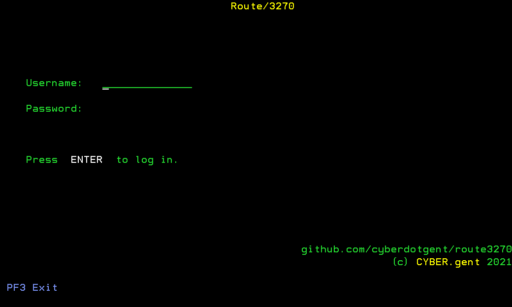
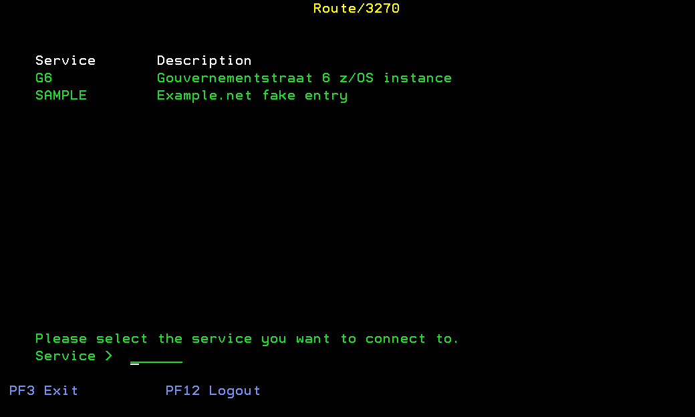

# Route/3270

A simple TN3270 router that can be used to route access to several applications or machines behind a single gateway

## Features

* Crude access control system for proxied services
* Authentication
* 2FA support using TOTP

### Screenshots

_login screen_

_service selection screen_

## Usage

### Basic usage

    route3270 -c example.toml
    
Review the `example.toml` file for usage instructions.

### Setting up TOTP based 2FA

You can generate OTP keys using `route3270 -g -c example.toml`. These keys then need to be added to the appropriate user entry, as well as the users' TOTP app (such as Google Authenticator).

## Current limitations

* Each user can only have up to 14 services to chose from.
* Does not support SSL (both server and client)